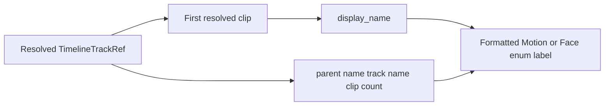

# Timeline First-Clip Label Design

## Status

Approved design for showing the first resolved clip name in Motion and Face Timeline dropdown labels.

## Problem

The Timeline selectors currently show only the parent group, track name, and resolved clip count. When several character or timeline tracks have similar names, the user cannot identify a track's content without selecting it.

## Goal

Make the first resolved clip name visible in every Motion and Face Timeline dropdown entry while preserving existing selection behavior and stable source IDs.

## Design

Update [`timeline_track_enum()`](../../../blender/panels/importer.py:68), which formats searchable Blender enum entries. For each [`TimelineTrackRef`](../../../blender/core/timeline.py:70), read the first item in its resolved [`clips`](../../../blender/core/timeline.py:77) tuple and use its [`TimelineClipSpec.display_name`](../../../blender/core/timeline.py:43).

The label format will be:

```text
{parent_name} / {track_name} / {first_clip_name} / {clip_count} clips
```

Examples:

```text
Motion Group / Character0 / first_clip / 2 clips
Face  Group / Character0_insert / first_face_clip / 7 clips
```

If a track has no successfully resolved clips, use `<no clips>` as the first-clip placeholder:

```text
Motion Group / Character0 / <no clips> / 0 clips
```

The enum identifier remains [`TimelineTrackRef.source_id`](../../../blender/core/timeline.py:73), and the icon remains derived from [`TimelineTrackRef.kind`](../../../blender/core/timeline.py:76). No resolver, catalog, import operator, source mapping, or cache behavior changes are required.

## Data Flow



## Error Handling

The formatter must not index an empty tuple. It will use `<no clips>` when no valid clips remain after catalog resolution. Existing diagnostics remain unchanged and continue to be handled by the catalog/import flow.

## Testing

Update [`tests/test_timeline_catalog.py`](../../../tests/test_timeline_catalog.py:105) so the existing searchable-label test verifies first clip names for both Motion and Face entries. Add a focused empty-track test using a [`TimelineTrackRef`](../../../blender/core/timeline.py:70) with no clips and verify that the formatter returns `<no clips>` without raising.

The tests must also continue verifying that enum identifiers are source IDs and that non-Timeline groups are excluded.

## Acceptance Criteria

1. Motion labels include the first resolved clip name.
2. Face labels include the first resolved clip name.
3. Labels retain parent name, track name, and clip count in the specified order.
4. Empty tracks display `<no clips>` safely.
5. Stable enum IDs, icons, selection lookup, and import behavior remain unchanged.
6. Timeline catalog tests pass.
